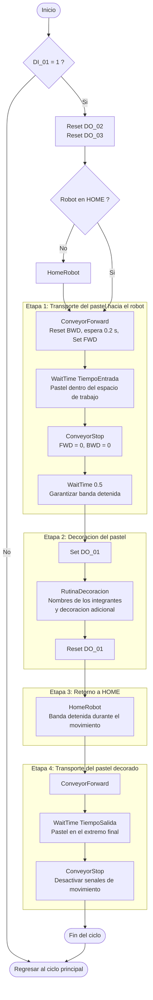

# Ciclo de decoración

```mermaid
flowchart TD
    A([Inicio]) --> B{"DI_01 = 1 ?"}
    B -- No --> Z([Regresar al ciclo principal])
    B -- Si --> C["Reset DO_02<br/>Reset DO_03"]
    C --> D{"Robot en HOME ?"}
    D -- No --> D1["HomeRobot"]
    D1 --> E
    D -- Si --> E

    subgraph ETAPA1["Etapa 1: Transporte del pastel hacia el robot"]
        E["ConveyorForward<br/>Reset BWD, espera 0.2 s, Set FWD"]
        E --> F["WaitTime TiempoEntrada<br/>Pastel dentro del espacio de trabajo"]
        F --> G["ConveyorStop<br/>FWD = 0, BWD = 0"]
        G --> H["WaitTime 0.5<br/>Garantizar banda detenida"]
    end

    H --> I

    subgraph ETAPA2["Etapa 2: Decoracion del pastel"]
        I["Set DO_01"]
        I --> J["RutinaDecoracion<br/>Nombres de los integrantes<br/>y decoracion adicional"]
        J --> K["Reset DO_01"]
    end

    K --> L

    subgraph ETAPA3["Etapa 3: Retorno a HOME"]
        L["HomeRobot<br/>Banda detenida durante el movimiento"]
    end

    L --> M

    subgraph ETAPA4["Etapa 4: Transporte del pastel decorado"]
        M["ConveyorForward"]
        M --> N["WaitTime TiempoSalida<br/>Pastel en el extremo final"]
        N --> O["ConveyorStop<br/>Desactivar senales de movimiento"]
    end

    O --> P([Fin del ciclo])
    P --> Z
```