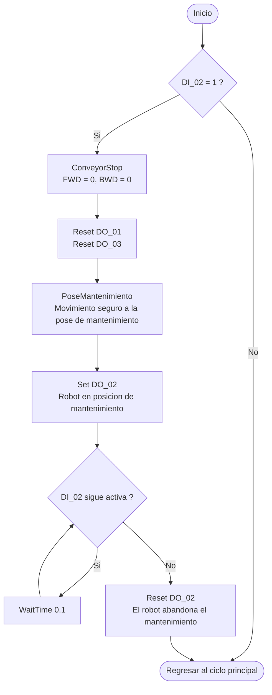

# Pose de mantenimiento

```mermaid
flowchart TD
    A([Inicio]) --> B{"DI_02 = 1 ?"}
    B -- No --> Z([Regresar al ciclo principal])
    B -- Si --> C["ConveyorStop<br/>FWD = 0, BWD = 0"]
    C --> D["Reset DO_01<br/>Reset DO_03"]
    D --> E["PoseMantenimiento<br/>Movimiento seguro a la pose de mantenimiento"]
    E --> F["Set DO_02<br/>Robot en posicion de mantenimiento"]
    F --> G{"DI_02 sigue activa ?"}
    G -- Si --> H["WaitTime 0.1"]
    H --> G
    G -- No --> I["Reset DO_02<br/>El robot abandona el mantenimiento"]
    I --> Z
```